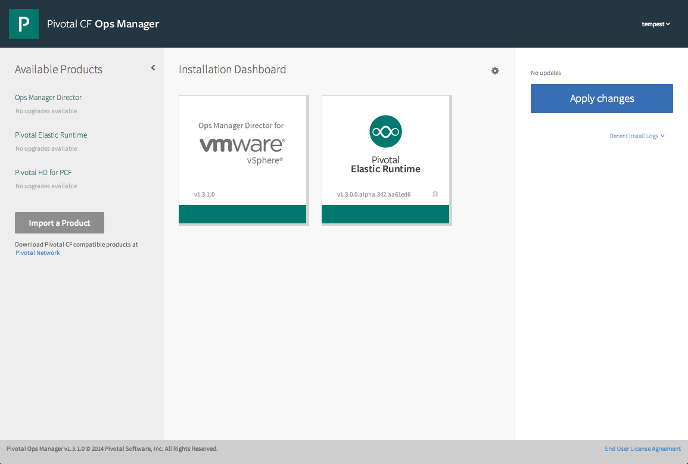
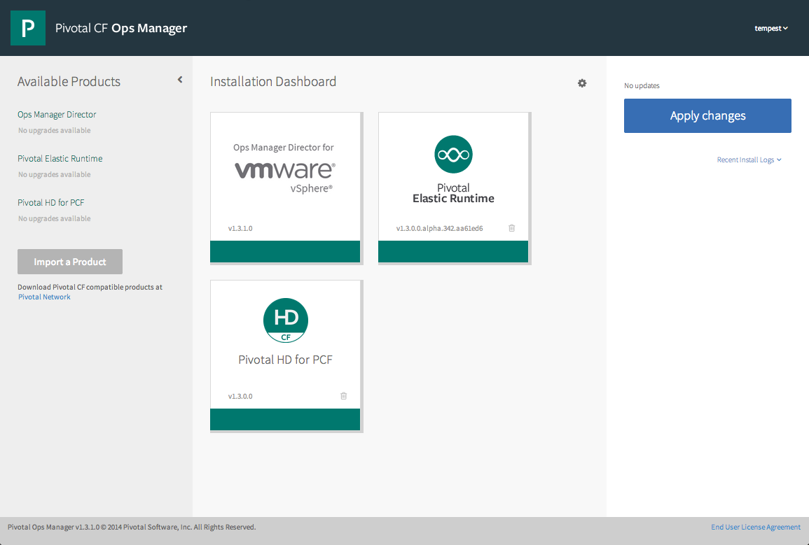
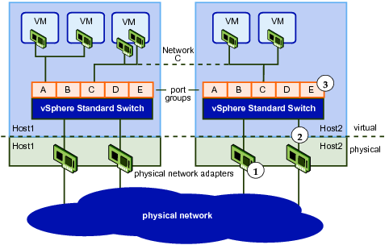

* [Prerequisistes](#prereq)

* [Installation Steps](#install)

* [Upgrading from Version 1.2.x.0 to 1.3.0.0](#upgrade1300)

* [About vSphere Networking Configurations](#vsphere)

#Prerequisites

Before you begin your [Pivotal HD for Pivotal Cloud Foundry&reg;](https://network.pivotal.io/products/pivotal-hd-service) deployment, make sure that your system meets the following minimum requirements:

* An installed instance of [Pivotal Cloud Foundry&reg;](https://network.pivotal.io/products/pivotal-cf) (PCF) Ops Manager v1.3.2.0
* Pivotal Cloud Foundry&reg; Elastic Runtime installed in Ops Manger
* Network access and credentials for the Ops Manager Web Console
* 7 IP Addresses in the vSphere Network where you plan to deploy the Pivotal HD Service Broker. See [Configuring Network Segmentation in Ops Manger](http://docs.pivotal.io/pivotalcf/customizing/network-segmentation.html) in the PCF documentation.
* Capacity in the vSphere cluster, resource pool, and datastore for the Pivotal HD Service Broker and related virtual machines as follows:

<table rules="all"
        frame="void">
        <caption>Table 1. Pivotal HD Service-Related Virtual Machines</caption>
        <col
            width="16%" />
        <col
            width="16%" />
        <col
            width="16%" />
        <col
            width="16%" />
        <col
            width="16%" />
        <col
            width="16%" />
        <thead>
            <tr>
                <th>Virtual Machine</th>
                <th>Instances</th>
                <th>CPU</th>
                <th>RAM (MB)</th>
                    <th>Operating System Root Disk (MB)</th>
                <th>Ephemeral Disk (MB)</th>
                <th>Persistent Disk (MB)</th>
            </tr>
        </thead>
        <tbody>
            <tr>
                <td>PHD-Broker</td>
                <td>1</td>
                <td>2</td>
                <td>4096</td>
                    <td>3072</td>
                <td>4096</td>
                <td>4096</td>
            </tr>
            <tr>
                <td>Route Registrar</td>
                <td>1</td>
                <td>1</td>
                <td>1024</td>
                    <td>3072</td>
                <td>1024</td>
                <td>0</td>
            </tr>
            <tr>
                <td>Broker Registrar</td>
                <td>1</td>
                <td>1</td>
                <td>2048</td>
                    <td>3072</td>
                <td>2048</td>
                <td>0</td>
            </tr>
            <tr>
                <td>Broker Deregistrar</td>
                <td>1</td>
                <td>1</td>
                <td>2048</td>
                    <td>3072</td>
                <td>2048</td>
                <td>0</td>
            </tr>
            <tr>
                <td>PHD Cleanup Tool</td>
                <td>1</td>
                <td>1</td>
                <td>2048</td>
                    <td>3072</td>
                <td>2048</td>
                <td>0</td>
            </tr>
            <tr>
                <td>Compilation</td>
                <td>2</td>
                <td>1</td>
                <td>1024</td>
                    <td>3072</td>
                <td>5632</td>
                <td>0</td>
            </tr>
                <tr>
                    <td><strong>Totals</strong></td>
                    <td><strong>7</strong></td>
                    <td><strong>7</strong></td>
                    <td><strong>12288</strong></td>
                    <td><strong>18432</strong></td>
                    <td><strong>16384</strong></td>
                    <td><strong>4096</strong></td>
                </tr>
        </tbody>
</table>
 

* A sufficient number of IP Address for the maximum number of Pivotal HD Clusters you will allow PCF users to create. Use the following formula to calculate the number of IP addresses:

<strong>Number of Clusters</strong> * (<strong>Number of PHD Components</strong> + <strong>Number of Slave VMs</strong> + <strong>2 Compilation VMs</strong>)

Where the **Number of PHD Components** is one component for each of the following software services you choose to deploy in your On-Demand cluster: NameNode, HDFS, HAWQ, YARN, GemFire XD.

* Capacity for each of the Pivotal HD cluster virtual machines as follows:

<table rules="all"
            frame="void">
            <caption>Table 2. Pivotal HD Instance Virtual Machines</caption>
            <col
                width="16%" />
            <col
                width="16%" />
            <col
                width="16%" />
            <col
                width="16%" />
            <col
                width="16%" />
            <col
                width="16%" />
            <thead>
                <tr>
                    <th>Virtual Machine</th>
                    <th>Instances</th>
                    <th>CPU</th>
                    <th>RAM (MB)</th>
                    <th>Operating System Root Disk (MB)</th>
                    <th>Ephemeral Disk (MB)</th>
                    <th>Persistent Disk (MB)</th>
                </tr>
            </thead>
            <tbody>
                <tr>
                    <td>NameNode</td>
                    <td>1</td>
                    <td>1</td>
                    <td>2048</td>
                    <td>3072</td>
                    <td>0</td>
                    <td>8192</td>
                </tr>
                <tr>
                    <td>Resource Manager</td>
                    <td>1</td>
                    <td>1</td>
                    <td>2048</td>
                    <td>3072</td>
                    <td>5120</td>
                    <td>0</td>
                </tr>
                <tr>
                    <td>HAWQ Master</td>
                    <td>1</td>
                    <td>1</td>
                    <td>2048</td>
                    <td>3072</td>
                    <td>0</td>
                    <td>4096</td>
                </tr>
                <tr>
                    <td>GemFire XD Locator</td>
                    <td>1</td>
                    <td>1</td>
                    <td>1024</td>
                    <td>3072</td>
                    <td>0</td>
                    <td>3072</td>
                </tr>
                <tr>
                    <td>PHD Slave</td>
                    <td>1</td>
                    <td>2</td>
                    <td>8192</td>
                    <td>3072</td>
                    <td>0</td>
                    <td>12288</td>
                </tr>
                <tr>
                    <td>Compilation</td>
                    <td>2</td>
                    <td>1</td>
                    <td>1024</td>
                    <td>3072</td>
                    <td>5120</td>
                    <td>0</td>
                </tr>
                <tr>
                    <td><strong>Totals</strong></td>
                    <td><strong>7</strong></td>
                    <td><strong>7</strong></td>
                    <td><strong>18432</strong></td>
                    <td><strong>18432</strong></td>
                    <td><strong>10240</strong></td>
                    <td><strong>27648</strong></td>
                </tr>
            </tbody>
        </table>

#Installation Steps
<ol>
        <li>Download the Pivotal HD Service's 1.3.2.0 software binary from
            <a  href="https://network.pivotal.io/products/pivotal-hd-service">The Pivotal Network</a>. </li>
        <li>Use a Web browser to log in to the <strong>Pivotal Ops Manager</strong> application. (This application is part of your PCF installation.) 
The <strong>Ops Manager Installation Dashboard</strong> displays:

            
 

        </li>

        <li> Click  <strong>Import a Product</strong>. 
 The <strong>Add Products</strong> screen displays.

        </li>
        <li>Click <strong>Choose File</strong> and navigate to the file you downloaded. 
The file uploads to your PCF deployment. 

        </li>
        <li> Click <strong>Add</strong>. 
Pivotal Ops Manager adds a new tile for Pivotal HD Service to the Installation Dashboard. 

        </li>

        <li>Select the <strong>Pivotal HD for PCF</strong> tile.
The <strong>Pivotal HD</strong> configuration page displays. 
</li>
            <li> (Optional) Select <strong>Assign Availability Zones</strong> to configure which Availability Zone you want Ops Manager to use to deploy the Pivotal HD Service Broker and virtual machines.  The Pivotal HD Service Broker and related VMs are all singleton jobs, meaning that only one virtual machine is deployed for each type.  The only exception is the compilation job, which deploys two virtual machines. 
See <a
                        href="http://docs.pivotal.io/pivotalcf/customizing/vsphere-config.html">Configuring Ops Manager Director for VMware vSphere </a>
</li>
            <li>(Optional) Select the <strong>Assign Networks</strong> tab if you want to change the vSphere Network where Ops Manager deploys the Pivotal HD Service Broker and related virtual machines.
            </li>
        <li>Click <strong>Save</strong>.</li>
        <li>
            
Select <strong>Pivotal HD Instance Network Settings</strong>.

            
For details on network configuration and examples, including managing the IP address space between Ops Manager and Pivotal HD, see <a
                href="#vsphere">About vSphere Networking</a>.

        </li>
        <li>
            
Configure the following network settings  you want to use when deploying the various virtual machines (See <a href="#service_vms">Table 1. Pivotal HD Service-Related Virtual Machines</a>) that make up each Pivotal HD cluster:

            <table
                frame="void" rules="all">
                <caption>Table 3. Pivotal HD Instance Network Settings</caption>
                <col
                    width="33%" />
                <col
                    width="33%" />
                <col
                    width="33%" />
                <thead>
                    <tr>
                        <th>Field</th>
                        <th>Description</th>
                    </tr>
                </thead>
                <tbody>
                    <tr>
                        <td>Network Name</td>
                        <td> The vSphere Network Name you want the Pivotal HD Service to deploy Pivotal HD virtual machines to.  For example, if the Network is called <b>Network1</b> in vCenter, specify it as <b>Network1</b> in this field. </td>
                    </tr>
                    <tr>
                        <td>IP Address Subnet</td>
                        <td> A valid subnet for the vSphere Network specified above in which to deploy virtual machines.  Enter the subnet using CIDR notation. For example: <code>10.0.0.0/16</code>.</td>
                    </tr>
                    <tr>
                        <td>Excluded IP Address Range</td>
                        <td> Any IP addresses you want the Pivotal HD Service to <i>not</i> assign to Pivotal HD virtual machines.  
Separate multiple ranges with commas. For example:

<code>10.10.10.2-10.10.10.10,
                            10.10.10.200-10.10.10.254</code>
</td>
                    </tr>
                    <tr>
                        <td>DNS Servers</td>
                        <td> One or more IP Addresses you want the Pivotal HD Service to configure as the Domain Name Servers on each Pivotal HD virtual machine.  For example:

                            <code>8.8.8.8, 9.9.9.9</code>
                        
</td>
                    </tr>
                    <tr>
                        <td>Default Gateway IP Address</td>
                        <td> The IP address you want the Pivotal HD Service to configure as the default gateway on each Pivotal HD virtual machine. </td>
                    </tr>
                </tbody>
            </table>
            
<strong>Note:</strong> If you make changes to these network configurations, the changes only affect creation of <em>new</em> service instances. Any pre-created services instances are destroyed and re-created using the new configurations. Existing allocated or bound service instances are not changed.

        </li>
        <li>
            
Click <strong>Save</strong>.

        </li>

        <li>Select <strong>On-demand Service Plans</strong> to configure one or more On-Demand Service Plans. The default Service Plan defines a Pivotal HD cluster that includes HDFS, YARN/MapReduce, HAWQ, and deploys up to three five-node clusters comprised of the four component’s master processes and one VM running all components’ slave processes. You can use the default Service Plan as-is, or you can modify the Service Plan for your requirements. See <a
            href="service_plans.html">Creating On-Demand Service Plans</a></li>
        <li> (Optional) Select <strong>External Service Plans</strong> to configure one or more External Service Plans.  See <a
                    href="external-service-plans.html"
                    shape="rect"
                    style="text-decoration:none;">Creating External Service Plans</a> for more information. </li>
        <li>Click the <strong>Installation Dashboard</strong> link.
The <strong>Installation Dashboard</strong> screen displays. 
</li>
        <li>
            
Click <strong>Apply Changes</strong>.

            
 During this installation, Ops Manager deploys a virtual machine to run the Pivotal HD Service Broker.  A progress meter displays the progress of the installation.
           When the installation is complete, the Pivotal HD Service Broker deploys the configured number of pre-created instances of Pivotal HD for each configured On-Demand Service Plan.

            
To create cluster instances, see <a
                href="data_service.html">Using Pivotal HD Service</a>.

        </li>
    </ol>

<strong>Note:</strong> You can access information about these deployments from the BOSH command-line interface and not from the Ops Manager console. 

<strong>Note:</strong> Once the pre-created Pivotal HD instances are deployed, the Pivotal HD Service broker automatically registers the service in the Elastic Runtime Marketplace.  Once the service is registered, PCF users can create instances of the configured service plans.

<h1>Upgrading From Version 1.2.x.0 to Version 1.3.2.0</h1>
        <ol>
            <li>Download the Pivotal HD Service’s v1.3.2.0 software binary from <a href="https://network.pivotal.io/products/pivotal-hd-service">The Pivotal Network</a>. </li>
            <li>Use a Web browser to log in to the Pivotal Ops Manager application. (This application is part of your PCF installation.) 
The <strong>Ops Manager Installation Dashboard </strong>displays.

			
			</li>
            <li>Click <strong>Import a Product</strong>. 
The <strong>Add Products</strong> screen displays.
</li>
            <li>Click <strong>Choose File</strong> and navigate to the file you downloaded. 
The file uploads to your PCF deployment.
</li>
            <li> Click <strong>Upgrade</strong>. 
The following notification displays: <strong>The Product 'p-hd' has been successfully upgraded to version '1.3.2.0'</strong> and the <strong>Pivotal HD for PCF</strong> tile now displays version 1.3.2.0.
</li>
            <li> Even if you selected a subset of Pivotal HD components in the On-Demand Service Plan that you deployed using version 1.2.x.x, all components will be selected by default after you upgrade. Review and modify the pre-existing On-Demand Service Plan. See <a href="service_plans.html#modifying">Modifying an On-Demand Service Plan</a> </li>
            <li>If you do not want to make any additional changes to your Service Plans, click <strong>Apply Changes</strong>. </li>
        </ol>
        
During this installation, Ops Manager updates the version of the Pivotal HD Service Broker. A progress meter displays the progress of the installation. 

        
When the installation is complete, the Pivotal HD Service Broker destroys and re-deploys new pre-created instances of Pivotal HD using the Pivotal HD 2.0.1 binaries. (The number of instances depends on the configured number of pre-created instances defined in each On-Demand Service Plan.)

        

            <strong>Note:</strong> Allocated Pivotal HD Service Instances are not modified in any way and cannot be upgraded or changed.

#About vSphere Networking Configurations

This section describes vSphere configurations that you define on the **Network Settings** page.

When configuring the Pivotal HD Service, you define which vSphere network you want the Pivotal Service Broker to use when deploying the virtual machines that comprise each Pivotal HD cluster.  This network can either be the same or different as the one you have configured Operations Manager to use when deploying PCF.

Consider the following vSphere network diagram:

##Deploying Pivotal Cloud Foundry&reg; and Pivotal HD on the Same Network

If Operations Manager has been configured to deploy PCF and any imported Services to network A in the picture above, you can configure the Pivotal HD Service to also deploy Pivotal HD clusters to network A.  If you choose to use the same network as PCF, it is likely you will use IP addresses from a single IP subnet across all deployments.  Should you choose to use IP addresses from the same subnet, you must ensure that Operations Manager and the Pivotal HD Service do not attempt to use the same IP addresses in their deployments.

To achieve this, you must exclude the IP range you want the Pivotal HD deployments to use in the Ops Manager vSphere network settings and you must exclude the IP range you want Ops Manager deployments to use in the Pivotal HD Service's network settings.

Here is an example of how you might do that if you were deploying everything to the IP subnet 10.0.0.0/16.  In this example, we are reserving the first 512 IP Addresses for Operations Manager and the next 512 IP addresses for the Pivotal HD Service.

**vSphere Network Settings Tab:**

* Network Name: `vSphereNetwork_A`
* IP Address Subnet: `10.0.0.0/16`
* Excluded IP Address Range: `10.0.2.1-10.0.3.254` (IP addresses s you want the Pivotal HD Service to use in Pivotal HD deployments)
* DNS Servers: `8.8.8.8`
* Default Gateway IP Address: `10.0.0.1`

**Pivotal HD Service Network Settings Tab:**

* Network Name: `vSphereNetwork_A`
* IP Address Subnet: `10.0.0.0/16`
* Excluded IP Address Range: `10.0.0.1-10.0.2.0`  (IPs you want Operations Mgr to use in PCF deployments)
* DNS Servers: `8.8.8.8`
* Default Gateway IP Address: `10.0.0.1`

##Deploying Pivotal Cloud Foundry&reg; and Pivotal HD on Different Networks

Alternatively, you could configure Ops Manager to deploy Pivotal Cloud Foundry&reg; to Network A and the Pivotal HD Service to deploy Pivotal HD clusters to Network C.  The only requirement in this case is that the two networks be able to route traffic to each other.  If a firewall is placed between the two networks, you must ensure that these ports are opened to allow unrestricted traffic between the BOSH agent and director:

<table
    frame="void" rules="all">
    <caption>Table 4. Open Ports Required for BOSH Communication</caption>
    <col
                   width="33%" />
                <col
                    width="33%" />
                <col
                    width="33%" />
                <thead>
                    <tr>
                        <th>Port</th>
                        <th>Protocol</th>
                        <th>Service</th>
                    </tr>
                </thead>
                <tbody>
                <tr>
                        <td>4222</td>
                        <td>tcp</td>
                        <td>nats</td>
                </tr>
                <tr>
                        <td>25250</td>
                        <td>tcp</td>
                        <td>blobstore</td>
                        </tr>
                <tr>
                        <td>53</td>
                        <td>tcp and udp</td>
                        <td>powerdns</td>
                </tr>
                </tbody>
              </table>

