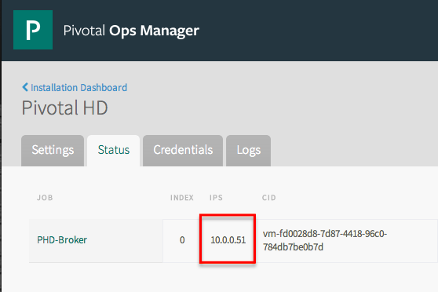
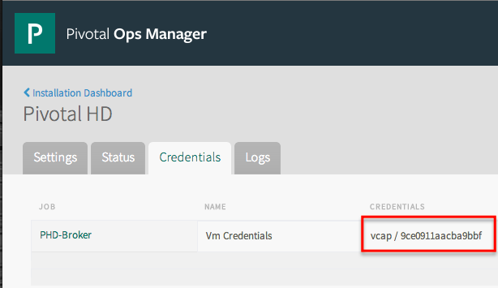

This section discusses tools and procedures you can use to diagnose problems with a Pivotal HD cluster instance. 

If you need to access a virtual machine in your Pivotal HD cluster or if you need to access the virtual machine that runs Pivotal HD Service, you can use Pivotal CF Ops Manager to display the necessary credentials and URLs. Ops Manager also displays the status of each virtual machine and enables you to download its log files. 

<ul>
            <li><a
                    href="#creds">Locating credentials and URLS of virtual machines in a cluster</a></li>
            <li><a
                    href="#logs">Accessing the log files of the PHD-Broker virtual machine</a></li>
            <li><a
                    href="#bosh">Using BOSH Director to Examine a PHD Deployment</a></li>
            <li><a
                    href="#ssh">Accessing Pivotal HD Cluster Instance virtual machines using SSH</a></li>
            <li><a
                    href="#delete_service">Deleting the Pivotal HD Service Broker from Cloud Foundry</a></li>
</ul>

<h1>Locating the credentials and URL of the Pivotal HD Service broker</h1><ol>
            <li>
                
Use a Web browser to open the <strong>Pivotal CF Ops Manager</strong> application. 

            </li>
            <li>
                
Click the <strong>Pivotal HD</strong> tile. 

            </li>
            <li>
                
Click the <strong>Credentials</strong> tab.

                
The credentials for the PHD-Broker virtual machine display. 

            </li>
            <li>Click the <strong>Status</strong> tab. 
The IP address of the PHD-Broker virtual machine displays.
</li>
        </ol>
        
<h1>Accessing the log files of the PHD-Broker virtual machine</h1>
<ol>
            <li>Locate the credentials and URL of the PHD-Broker virtual machine as described <a
                    href="#creds">above</a>. </li>
            <li>Using this URL and credentials, log in to the PHD-Broker virtual machine using ssh:<pre># ssh vcap@10.0.0.51 
vcap@10.0.0.51's password: 
Last login: Wed May 7 15:13:04 2014 from 10.0.0.1 
[vcap@21c20803-7459-46dc-a0f7-36c70c956db4 ~]</pre></li>
            <li>There are two relevant log files you may want to access:<ul>
                    <li>
                        <code>/var/vcap/sys/log/phd-broker/broker.out</code> - these are the logs from the PHD-Broker that contain entries about starting the broker, deploying PHD instances, and binding to applications. </li>
                    <li>
                        <code>/var/vcap/sys/log/phd-broker/phd-broker.stdout.log</code> - these are the logs from the general shell commands, including bosh deployments. These log files include more detailed output from specific commands and can be useful when trying to debug a specific issue where there was a failure reported in one of the other logs. </li>
                </ul></li>
        </ol>
       

        

<h1>Using BOSH Director to Examine a PHD Deployment</h1>
        
You can use the BOSH command-line tools to log in to the BOSH Director to run diagnostic commands that examine a Pivotal CF installation, including your Pivotal HD cluster instances. The BOSH Director runs on the virtual machine that Ops Manager deploys on the first install of the Ops Manager Director for VMware vSphere.

<ol>
            <li>Follow the instructions in the <a
                    href="http://docs.gopivotal.com/pivotalcf/customizing/trouble-advanced.html">Advanced Troubleshooting with the BOSH CLI</a> to access the BOSH Director from the Ops Manager VM. </li>
            <li>
                
Log in to the BOSH Director.

            </li>
            <li>
                
Run one of the following commands: 

            </li>
        </ol>
        <ul>
            <li>bbbebetterssdfrsadf
                
<code>bosh deployments</code>

                
Displays a list of deployments. For example:

                <pre class="terminal">
$ bosh deployments

+---------------------------------+--------------------------------+-------------------------------+
| Name                            | Release(s)                     | Stemcell(s)                   |
+---------------------------------+--------------------------------+-------------------------------+
| cf-5f2b8491a89b0598c95c         | cf/169                         | bosh-vsphere-esxi-ubuntu/2366 |
|                                 | push-console-release/6         |                               |
|                                 | runtime-verification-errands/1 |                               |
+---------------------------------+--------------------------------+-------------------------------+
| phd-1                           | phd/282                        | bosh-vsphere-esxi-centos/1868 |
+---------------------------------+--------------------------------+-------------------------------+
| phd-2                           | phd/282                        | bosh-vsphere-esxi-centos/1868 |
+---------------------------------+--------------------------------+-------------------------------+
| phd-3                           | phd/282                        | bosh-vsphere-esxi-centos/1868 |
+---------------------------------+--------------------------------+-------------------------------+
| phd-broker-037b5a195ed32bdf4e61 | phd-broker/277                 | bosh-vsphere-esxi-centos/1868 |
+---------------------------------+--------------------------------+-------------------------------+
 Deployments total: 5
</pre>
            </li>
            <li>
                
<code>bosh vms</code>

                
Displays a list of virtual machines in the environment for all deployments. To limit the list to a specific deployment, enter its name as the first argument. For example:

                <pre class="terminal">
$ bosh vms phd-3
Deployment `phd-3'

Director task 151

Task 151 done

+-------------------+---------+-----------------+-----------+
| Job/index         | State   | Resource Pool   | IPs       |
+-------------------+---------+-----------------+-----------+
| gfxd-locator/0    | running | gfxd-locator    | 10.0.1.29 |
| namenode/0        | running | namenode        | 10.0.1.27 |
| phd-slave/0       | running | worker          | 10.0.1.30 |
| resourcemanager/0 | running | resourcemanager | 10.0.1.28 |
+-------------------+---------+-----------------+-----------+

VMs total: 4
</pre>
                
You can also add the <code>--detail</code> flag to include the names of each virtual machine. For example:

                <pre class="terminal">
[root@rock ~]# bosh vms phd-3 --detail
Deployment `phd-3'

Director task 152

Task 152 done

+-------------------+---------+-----------------+-----------+-----------------------------------------+--------------------------------------+--------------+
| Job/index         | State   | Resource Pool   | IPs       | CID                                     | Agent ID                             | Resurrection |
+-------------------+---------+-----------------+-----------+-----------------------------------------+--------------------------------------+--------------+
| gfxd-locator/0    | running | gfxd-locator    | 10.0.1.29 | vm-e7cacaec-8190-4841-81fb-ae7ca4784ea1 | 4718b1bf-1af7-4fc9-802c-36037f0a30cc | active       |
| namenode/0        | running | namenode        | 10.0.1.27 | vm-8eac5c1a-de57-414d-a109-c1117eb58cad | 5c45c684-46ac-4f76-a285-e507beeb029b | active       |
| phd-slave/0       | running | worker          | 10.0.1.30 | vm-889afcd8-02ac-42bf-b848-992716a34cec | 75a00ccd-cad8-45dd-9369-2274e1b4ec01 | active       |
| resourcemanager/0 | running | resourcemanager | 10.0.1.28 | vm-a64bc3fa-fdd0-40c0-8311-fe854b72ff16 | 3551bb58-e2e1-4bc2-8a7c-c941391f3679 | active       |
+-------------------+---------+-----------------+-----------+-----------------------------------------+--------------------------------------+--------------+

VMs total: 4
</pre>
            </li>
            <li>
                
<code>cf services</code>

                
Displays a list of Cloud Foundry services, including any instances of Pivotal HD Service. For example:

                <pre class="terminal">
$ cf services
Getting services in org pivotalrocks / space staging as admin...
OK

nameservice   plan   bound apps 
phd-clus1   p-hd  Standard   app-sinatra-services   

</pre>
            </li>
            <li>
                
<code>cf service-brokers</code>

                
Displays a list of Cloud Foundry service brokers. For example:

                <pre class="terminal">
$ cf service-brokers
Getting service brokers as admin...

name url   
phd-broker   http://10.0.0.51:8080
</pre>
            </li>
            <li>
                
<code>cf delete-service-broker</code>

                
Deletes a Cloud Foundry service broker.

            </li>
            <li>
                
<code>bosh delete deployment</code>

                
Deletes a BOSH deployment. 

            </li>
            <li>
                
<code>bosh releases</code>

                
Displays a list of available releases. 

            </li>
        </ul>
        

        <h1>Accessing Pivotal HD Cluster Instance virtual machines using SSH</h1>
        
Although it is not usually necessary to access machines within a Pivotal HD cluster directly, there may be troubleshooting situations where you need to access a cluster machine using SSH. To access these machines, you need to locate the Piovtal HD Service Instance ID for the cluster and then use that information to get a list of cluster IP addresses you can use for ssh access. 

        
Pivotal HD Service creates these Service Instance IDs when it pre-creates cluster instances. When a user creates a cluster instance using Pivotal HD Service, the user creates a service instance name for the cluster. Internally, Pivotal HD Service maps this user-defined name to the cluster instance ID. 

        
To determine which Virtual Machines are associated with a specific Service Instance, you can use the Dev Console, or use the Pivotal CF CLI. 

<strong>To determine which Virtual Machines are associated with a specific Service Instance, using the PIvotal CF Dev Console:</strong>
        
<ol>
            <li>
                
Log in to the <strong>Pivotal CF Developer Console</strong>.

            </li>
            <li>
                
Select your Org from the drop-down list on the left.

            </li>
            <li>Select your Space from the list of spaces on the left.
A list of applications and service instances displays. 
</li>
            <li>In the row that contains the Pivotal HD service instance you want to access, click <strong>Manage</strong>.
				
			
The Service Instance Dashboard displays:
</li>
            <li>Click the links to access the Web interface for the component.</li>
        </ol>
<strong>To determine which Virtual Machines are associated with a specific Service Instance, using the Pivotal CF CLI</strong>: 

To take the following steps to look up the mapping:

        <ol>
            <li>Log into the Pivotal CF command line instance that manages your Pivotal CF deployment.</li>
            <li>From the Pivotal CF command line, make sure you are targeting the space where the Service Instance you are interested in resides: <pre class="terminal">[root@rock ~]# cf target
API endpoint: https://api.rock.music.cf-app.com (API version: 2.2.0)
User: admin
Org:  pivotalrocks
Space:staging
</pre> If necessary, select a space using the following command: $ cf target -s &lt;space name&gt; </li>
            <li> From the Pivotal CF CLI, confirm the Service Instance Name you are interested in: <pre class="terminal">
root@rock ~]# cf services
Getting services in org pivotalrocks / space staging as admin...
OK

nameservice   plan   bound apps 
instance1   p-hd  Standard  
instance2   p-hd  Standard   app-sinatra-services   
</pre>
            </li>
            <li> From the Pivotal CF CLI, run the following command to look up the Cloud Controller ID for the Service Name you are interested in. The Cloud Controller ID is contained in a JSON-formatted output. To find the ID, locate the name of your service in the output and then locate the <code>guid</code> field within that data structure. The value of this field contains the Cloud Controller ID. For example, in the following output, the Cloud Controler ID for the service that is named <code
                    style="color:red">instance2</code> is highlighted in red: <pre class="terminal">[root@rock ~]# CF_TRACE=true cf s

VERSION:
6.0.2-0bba99f

Getting services in org pivotalrocks / space staging as admin...

REQUEST: [2014-05-07T21:07:15+02:00]
GET /v2/spaces/5482fff0-42cb-4392-945d-8d83713abaf0/summary HTTP/1.1
Host: api.rock.music.cf-app.com
Accept: application/json
Authorization: [PRIVATE DATA HIDDEN]
Content-Type: application/json
User-Agent: go-cli 6.0.2-0bba99f / linux

RESPONSE: [2014-05-07T21:07:15+02:00]
HTTP/1.1 200 OK
Content-Length: 1535
Content-Type: application/json;charset=utf-8
Date: Wed, 07 May 2014 19:08:15 GMT
Server: nginx
X-Content-Type-Options: nosniff
X-Vcap-Request-Id: 1f201b6b1881d2957ec572f17eb63b4e::00245095-8317-4547-9c93-a8bc34cd7314

{"guid":"5482fff0-42cb-4392-945d-8d83713abaf0","name":"staging","apps":[{"guid":"f23e0d52-13be-434e-b579-ce2a1bad8d79","urls":["app-sinatra-services.rock.music.cf-app.com"],
"routes":[{"guid":"78161142-f97c-460d-b03e-1f7a748406cc","host":"app-sinatra-services","domain":{"guid":"58b2649a-a127-4c8f-ac49-cb8ec1dd28e0","name":"rock.music.cf-app.com"}}],
"service_count":1,"service_names":["phd-dieu1"],"running_instances":1,"name":"app-sinatra-services",
"production":false,"space_guid":"5482fff0-42cb-4392-945d-8d83713abaf0","stack_guid":"f7ad92d1-c34f-4f37-8c25-a671514d73b6",
"buildpack":null,"detected_buildpack":"Ruby/Rack","environment_json":{},"memory":1024,"instances":1,
"disk_quota":1024,"state":"STARTED","version":"5ccc11f4-c9f6-4fa2-aac1-f14e227571f8","command":"bundle exec ruby main.rb -p $PORT","console":false,"debug":null,"staging_task_id":"8568a5a234524be5a97b8e770b4dbfd2","package_state":"STAGED","health_check_timeout":null}],
"services":[{"guid":"4914bc7d-da6a-4023-8427-822f17a320fb","name":"phd5","bound_app_count":0,"dashboard_url":null,
"service_plan":{"guid":"51eeae7e-4a29-424e-b636-424d1aaa92f1","name":"Standard","service":
{"guid":"aefee9cf-a789-4697-bebd-bafa47ae63a4","label":"p-hd","provider":null,"version":null}}},
{"guid":<strong style="color:red">"5719c2a0-69f2-4ca2-b46a-0f6058fa54af"</strong>,"name":<strong style="color:red">"instance2"</strong>,"bound_app_count":1,"dashboard_url":null,"service_plan":{"guid":"51eeae7e-4a29-424e-b636-424d1aaa92f1",
"name":"Standard","service":{"guid":"aefee9cf-a789-4697-bebd-bafa47ae63a4","label":"p-hd","provider":null,"version":null}}}]}

</pre>
            </li>
            <li>Log in to the Pivotal CF Ops Manager application. </li>
            <li> Select Pivotal HD.</li>
            <li>Click the <strong>Status</strong> tab and note the IP address for the Pivotal HD Service Broker. 

            </li>
            <li>Click the <strong>Credentials</strong> tab and note the username and password for the PHD-Broker 

.</li>
            <li>Using these IP address and credentials, log in to the Pivotal HD Service Broker using ssh: <pre class="terminal">[root@rock ~]# ssh vcap@10.0.0.51 
vcap@10.0.0.51's password: 
Last login: Wed May 7 15:13:04 2014 from 10.0.0.1 
[vcap@21c20803-7459-46dc-a0f7-36c70c956db4 ~]$</pre>
            </li>
            <li>Access the SQLite Database where the Service Broker stores its mappings: 
				<pre class="terminal">[vcap@21c20803-7459-46dc-a0f7-36c70c956db4 ~]$ cd /var/vcap/store/phd_broker/ 
[vcap@21c20803-7459-46dc-a0f7-36c70c956db4 phd_broker]$ sqlite3 database.sqlite3 
SQLite version 3.6.20 
Enter ".help" for instructions 
Enter SQL statements terminated with a ";" 
sqlite> .schema 
CREATE TABLE "ip_addresses" ("id" integer not null primary key autoincrement, "ip" text, "service_instance_id" integer, "job_name" text); 
CREATE TABLE "service_instances" ("id" integer not null primary key autoincrement, "cloud_controller_id" text, "state" text); 
sqlite> select * from service_instances; 
1|5719c2a0-69f2-4ca2-b46a-0f6058fa54af|ALLOCATED 
2|4914bc7d-da6a-4023-8427-822f17a320fb|ALLOCATED 
3||AVAILABLE 
sqlite></pre>
            </li>
            <li>Locate the row where the Cloud Controller ID matches the Cloud Controller ID you retrieved earlier. Note the numbers that begin each row. These numbers are the internal Service Instance IDs. </li>
            <li>Follow the instructions in the <a
                    href="http://docs.gopivotal.com/pivotalcf/customizing/trouble-advanced.html">Cloud Foundry documentation</a> to access the BOSH Director from the Ops Manager VM. </li>
            <li>Lookup the VMs associated with the Pivotal HD cluster instance that was mapped to the Service Instance ID using the following command: 
<code> [root@rock ~]# bundle exec bosh vms phd-&lt;Instance ID></code>

                
For example:

                <pre class="terminal">root@rock ~]# bundle exec bosh vms phd-1

Deployment `phd-1'

Director task 257

Task 257 done
+-------------------+---------+-----------------+-----------+
| Job/index         | State   | Resource Pool   | IPs       |
+-------------------+---------+-----------------+-----------+
| gfxd-locator/0    | running | gfxd-locator    |10.0.1.9   |
| hawq-master/0     | running | hawq-master     |10.0.1.8   |
| namenode/0        | running | namenode        |10.0.1.6   |
| phd-slave/0       | running | worker          |10.0.1.10  |
| resourcemanager/0 | running |resourcemanager  |10.0.1.7   |
+-------------------+---------+-----------------+-----------+
</pre>
            </li>
            <li>Note the IP address of the machine you want to access and use it to ssh to the virtual machine. </li>
        </ol>
        
        <h1>Deleting the Pivotal HD Service Broker from Cloud Foundry</h1>
        <ol>
            <li>Open the <strong>Pivotal CF Ops Manager</strong> application in a Web browser.
The Installation Dashboard displays.
</li>
            <li>Click the <strong>Trash</strong> icon in the Pivotal HD Data Service tile.</li>
            <li>Click <strong>Apply Changes</strong>.
The Pivotal HD Data Service broker is deleted. 
</li>
        </ol>
        
<strong>Note:</strong> If the PHD Data Service broker is in the process of deploying a pre-allocated Pivotal HD Cluster, when you click the Trash icon, the deletion will fail. Try the deletion at another time. 
