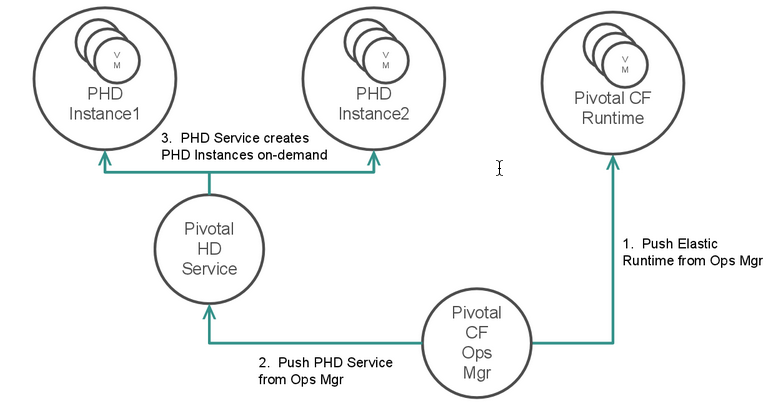
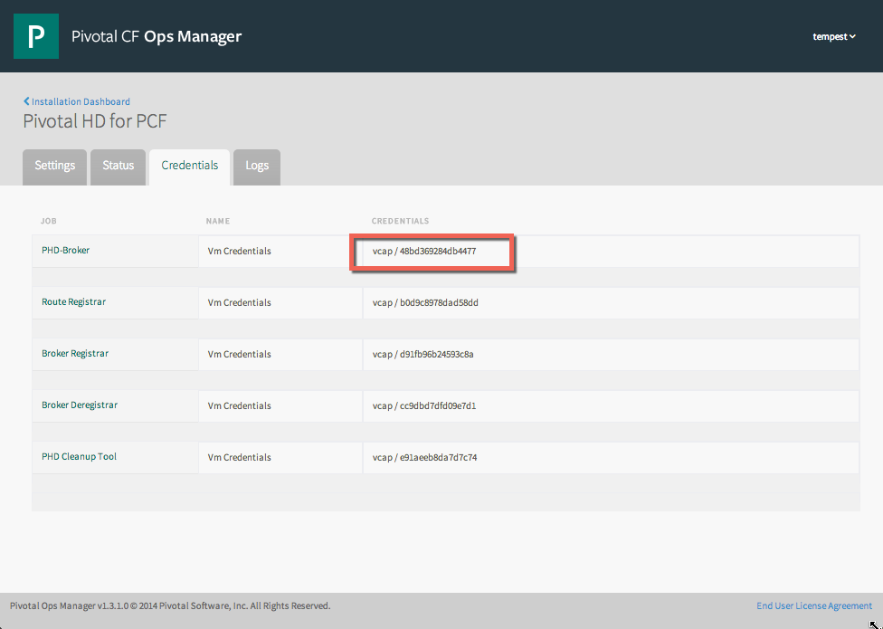
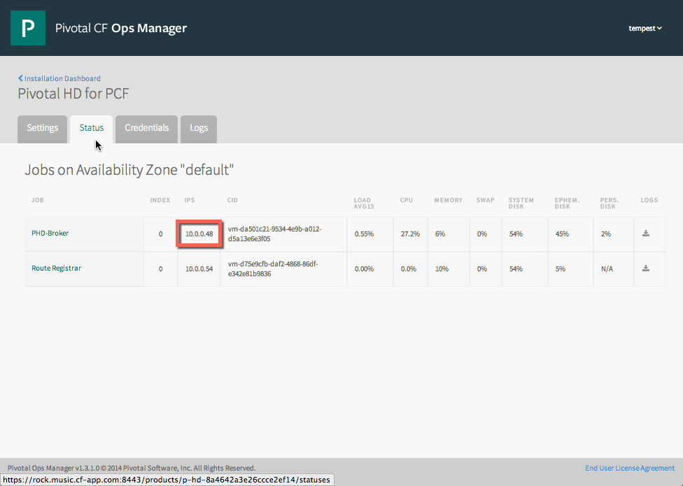
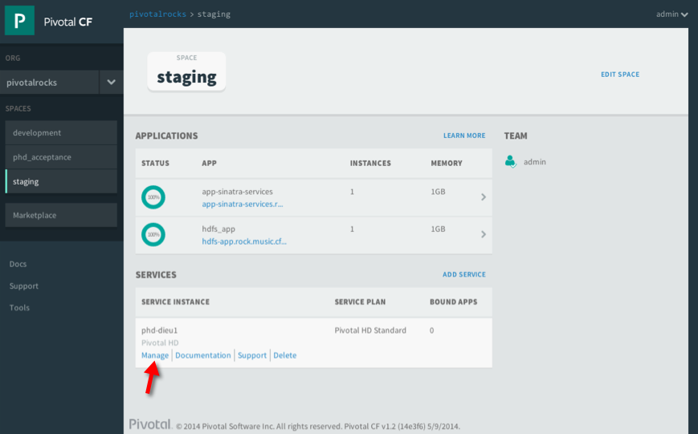
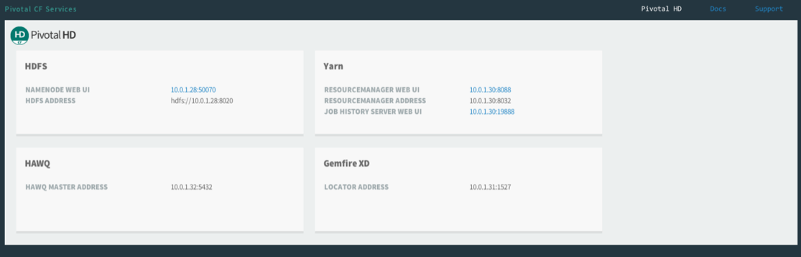

This section discusses tools and procedures you can use to diagnose problems with a Pivotal HD cluster instance. 

<ul>
            <li><a
                    href="#creds">Locating credentials and URLS of virtual machines in a cluster</a></li>
            <li><a
                    href="#logs">Accessing the log files of the PHD-Broker virtual machine</a></li>
            <li><a
                    href="#bosh">Using BOSH Director to Examine a PHD Deployment</a></li>
            <li><a
                    href="#ssh">Accessing Pivotal HD Cluster Instance virtual machines using SSH</a></li>
            <li><a
                    href="#delete_service">Deleting the Pivotal HD Service Broker from Cloud Foundry</a></li>
			<li><a
				   href="#phd_cmds">Pivotal HD Configuration File Locations and Commands</a></li>
        </ul>

If you need to access a virtual machine in your Pivotal HD cluster or if you need to access the virtual machine that runs Pivotal HD Service, you can do so. 

Information required to access the Pivotal HD Service Broker is displayed in a href="https://network.pivotal.io/products/pivotal-cf">Pivotal Cloud Foundry&reg;</a> (PCF) Ops Manager, which also displays the status of the virtual machine and enables you to download its log files in the same way as for other PCF tiles. 

Because the Pivotal HD Service Broker deploys Pivotal HD on-demand service instances, information about those deployments is not visible in Ops Manager but is visible using the BOSH Command Line Interface, which you can access using the Pivotal HD Service Broker’s terminal shell.  

        
        <h1>Locating the credentials and URL of the Pivotal HD Service broker</h1><ol>
            <li>
                
Use a Web browser to open the <strong>Ops Manager</strong> application. 

            </li>
            <li>
                
Click the <strong>Pivotal HD</strong> tile. 

            </li>
            <li>
Click the <strong>Credentials</strong> tab.

The credentials for the PHD-Broker virtual machine display. 
</li>
            <li>Click the <strong>Status</strong> tab. 
The IP address of the PHD-Broker virtual machine displays.
</li>
        </ol>
        
        <h1>Accessing the log files of the PHD-Broker virtual machine</h1>
        <ol>
            <li>Locate the credentials and URL of the PHD-Broker virtual machine as described <a
                    href="#creds">above</a>. </li>
            <li>Using this URL and credentials, log in to the Pivotal HD Service Broker's virtual machine using ssh:<pre ># ssh vcap@10.0.0.51
vcap@10.0.0.51's password:
Last login: Wed May 7 15:13:04 2014 from 10.0.0.1
[vcap@21c20803-7459-46dc-a0f7-36c70c956db4 ~]</pre></li>
            <li>There are two relevant log files you may want to access:<ul>
                    <li>
                        <code>/var/vcap/sys/log/phd-broker/broker.out</code> - these are the logs from the Pivotal HD Service Broker that contain entries about starting the broker, deploying Pivotal HD service instances, and binding to applications. </li>
                    <li>
                        <code>/var/vcap/sys/log/phd-broker/phd-broker.stdout.log</code> - these are the logs from the general shell commands, including bosh deployments. These log files include more detailed output from specific commands and can be useful when trying to debug a specific issue where there was a failure reported in one of the other logs. </li>
                </ul></li>
        </ol>
        

        

        <h1>Using BOSH Director to Examine a PHD Deployment</h1>
        
You can use the BOSH command-line tools to log in to the BOSH Director to run diagnostic commands that examine a PCF installation, including your Pivotal HD on-demand service instances.  Each service instance is a separate BOSH deployment.  The BOSH Director runs on a virtual machine that Ops Manager deploys on the first installation of the Ops Manager. 

You can <a
                href="https://github.com/cloudfoundry/bosh"
                shape="rect"
                style="text-decoration:none;">download the BOSH CLI</a> and run it from a host of your choosing.  Or you can SSH into the Pivotal HD Service Broker, where the BOSH CLI is already installed.  
        

        <ol>
            <li>Follow the instructions in the <a
                    href="#bosh">Accessing the log files of the PHD-Broker virtual machine</a> to login to the Pivotal HD Service Broker’s virtual machine.</li>
            <li>
                
Run one of the following commands: 

            </li>
        </ol>
        <ul>
            <li>
                
<code>bosh deployments</code>

                
Displays a list of deployments.  Deployments that serve as Pivotal HD on-demand service plan service instances follow the naming convention phd-#, where # is the chronological order of deployments.   For example:

                <pre >
$ bosh deployments

+---------------------------------+--------------------------------+-------------------------------+
| Name                            | Release(s)                     | Stemcell(s)                   |
+---------------------------------+--------------------------------+-------------------------------+
| cf-5f2b8491a89b0598c95c         | cf/169                         | bosh-vsphere-esxi-ubuntu/2366 |
|                                 | push-console-release/6         |                               |
|                                 | runtime-verification-errands/1 |                               |
+---------------------------------+--------------------------------+-------------------------------+
| phd-1                           | phd/282                        | bosh-vsphere-esxi-centos/1868 |
+---------------------------------+--------------------------------+-------------------------------+
| phd-2                           | phd/282                        | bosh-vsphere-esxi-centos/1868 |
+---------------------------------+--------------------------------+-------------------------------+
| phd-3                           | phd/282                        | bosh-vsphere-esxi-centos/1868 |
+---------------------------------+--------------------------------+-------------------------------+
| phd-broker-037b5a195ed32bdf4e61 | phd-broker/277                 | bosh-vsphere-esxi-centos/1868 |
+---------------------------------+--------------------------------+-------------------------------+
 Deployments total: 5
</pre>
            </li>
            <li>
                
<code>bosh vms</code>

                
Displays a list of virtual machines in the environment for all deployments. To limit the list to a specific deployment, enter its name as the first argument. For example:

                <pre >
$ bosh vms phd-3
Deployment `phd-3'

Director task 151

Task 151 done

+-------------------+---------+-----------------+-----------+
| Job/index         | State   | Resource Pool   | IPs       |
+-------------------+---------+-----------------+-----------+
| gfxd-locator/0    | running | gfxd-locator    | 10.0.1.29 |
| namenode/0        | running | namenode        | 10.0.1.27 |
| phd-slave/0       | running | worker          | 10.0.1.30 |
| resourcemanager/0 | running | resourcemanager | 10.0.1.28 |
+-------------------+---------+-----------------+-----------+

VMs total: 4
</pre>
                
You can also add the <code>--detail</code> flag to include IaaS-specific information for each virtual machine, which can help to find that VM in your IaaS tools, such as VMware’s vCenter.  For example:

                <pre >
[root@rock ~]# bosh vms phd-3 --detail
Deployment `phd-3'

Director task 152

Task 152 done

+-------------------+---------+-----------------+-----------+-----------------------------------------+--------------------------------------+--------------+
| Job/index         | State   | Resource Pool   | IPs       | CID                                     | Agent ID                             | Resurrection |
+-------------------+---------+-----------------+-----------+-----------------------------------------+--------------------------------------+--------------+
| gfxd-locator/0    | running | gfxd-locator    | 10.0.1.29 | vm-e7cacaec-8190-4841-81fb-ae7ca4784ea1 | 4718b1bf-1af7-4fc9-802c-36037f0a30cc | active       |
| namenode/0        | running | namenode        | 10.0.1.27 | vm-8eac5c1a-de57-414d-a109-c1117eb58cad | 5c45c684-46ac-4f76-a285-e507beeb029b | active       |
| phd-slave/0       | running | worker          | 10.0.1.30 | vm-889afcd8-02ac-42bf-b848-992716a34cec | 75a00ccd-cad8-45dd-9369-2274e1b4ec01 | active       |
| resourcemanager/0 | running | resourcemanager | 10.0.1.28 | vm-a64bc3fa-fdd0-40c0-8311-fe854b72ff16 | 3551bb58-e2e1-4bc2-8a7c-c941391f3679 | active       |
+-------------------+---------+-----------------+-----------+-----------------------------------------+--------------------------------------+--------------+

VMs total: 4
</pre>
            </li>
            <li>
                
<code>bosh tasks recent</code>

                
 Displays a list of recent tasks BOSH has executed.  This can help you understand the chronology of the creation and deletion of Pivotal HD service instance deployments as well as identify whether any deployments failed to complete successfully. For example:  

                <pre>[vcap@b00e86e6-27d7-4d62-bf34-2eea10f3c2e5 ~]$ bosh tasks recent

+----+-------+-------------------------+----------+---------------------+---------------------------------------------------------------------------+
| #  | State | Timestamp               | User     | Description         | Result                                                                    |
+----+-------+-------------------------+----------+---------------------+---------------------------------------------------------------------------+
| 38 | done  | 2014-10-03 07:00:01 UTC | admin    | snapshot deployment | snapshots of deployment 'phd-1' created                                   |
| 37 | done  | 2014-10-03 07:00:01 UTC | admin    | snapshot deployment | snapshots of deployment 'p-hd-a342a6fc4da4185762b8' created               |
| 36 | done  | 2014-10-03 07:00:01 UTC | admin    | snapshot deployment | snapshots of deployment 'cf-08d168825977e026afa2' created                 |
| 21 | done  | 2014-10-02 18:41:26 UTC | director | create deployment   | /deployments/phd-1                                                        |
| 19 | done  | 2014-10-02 18:33:09 UTC | director | create deployment   | /deployments/p-hd-a342a6fc4da4185762b8                                    |
| 20 | done  | 2014-10-02 18:32:16 UTC | director | create release      | Created release 'phd/1.3.cb21334042e773ad0de1f6d59fc4cafc1d323e11'        |
| 18 | done  | 2014-10-02 18:25:10 UTC | director | create stemcell     | /stemcells/bosh-vsphere-esxi-centos-go_agent/2690.2                       |
| 17 | done  | 2014-10-02 18:23:29 UTC | director | create release      | Created release 'phd-broker/1.3.2c02f5279e1df653d1600b12bf79d97a75a2e0f6' |
| 13 | done  | 2014-10-02 18:17:19 UTC | director | create deployment   | /deployments/cf-08d168825977e026afa2                                      |
| 12 | done  | 2014-10-02 07:00:03 UTC | admin    | snapshot deployment | snapshots of deployment 'cf-08d168825977e026afa2' created                 |
| 6  | done  | 2014-10-01 20:42:20 UTC | director | create deployment   | /deployments/cf-08d168825977e026afa2                                      |
| 5  | done  | 2014-10-01 19:13:19 UTC | director | create stemcell     | /stemcells/bosh-vsphere-esxi-ubuntu-trusty-go_agent/2682.2                |
| 4  | done  | 2014-10-01 19:11:52 UTC | director | create release      | Created release 'runtime-verification-errands/3'                          |
| 3  | done  | 2014-10-01 19:11:40 UTC | director | create release      | Created release 'push-console-release/207'                                |
| 2  | done  | 2014-10-01 19:11:20 UTC | director | create release      | Created release 'cf/183'                                                  |
| 1  | done  | 2014-10-01 18:55:28 UTC | director | create release      | Created release 'cf-mysql/10'                                             |
+----+-------+-------------------------+----------+---------------------+---------------------------------------------------------------------------+

Showing 16 recent tasks
</pre>
            </li>
            <li><code>bosh task <i>#</i></code>
 Displays the log output for a specific task number.  Replace <i>#</i> with the task number that displays in the bosh tasks recent output.  This can help you understand the details of why a deployment failed. For example:  
<pre>[vcap@b00e86e6-27d7-4d62-bf34-2eea10f3c2e5 ~]$ bosh task 38

Director task 38

Task 38 done
</pre></li>
        </ul>
        

        <h1>Accessing Pivotal HD Cluster Instance virtual machines using SSH</h1>
There may be troubleshooting situations where you want to access the virtual machines associated with an on-demand service instance where Pivotal HD software is running using SSH.  To access the virtual machines, you need the Pivotal HD Service Broker’s vcap user credentials, which can also be used to access any Pivotal HD service instance’s virtual machine, and the relevant machine’s IP address.  

Note that when a user creates a service instance for an on-demand service plan, the Pivotal HD Service Broker associates and maps one of its un-allocated BOSH deployments of virtual machines with that particular service instance’s unique ID.  IP addresses for the hosts that run each component’s master process like Hadoop’s NameNode and ResourceManager, HAWQ’s Master, and the GemFireXD Locator appear in the service instance dashboard.  The full list of IP addresses also appear in the <code>bosh vms</code> output.  

        <ol>
            <li>Use a Web browser to log in to the <strong>Ops Manager</strong> application. </li>
            <li>Select Pivotal HD.</li>
            <li>Click the <strong>Credentials</strong> tab and note the password for the Pivotal HD Service Broker’s <code>vcap</code> username.</li>
            <li>
                
Use a Web browser to log in to the <strong>Apps Manager</strong>.

            </li>
            <li>
                
Select the user who created the service instance you are interested in from the drop-down list on the left.

            </li>
            <li>Select the Space where the service instance was created from the list of spaces on the left.
A list of applications and service instances displays. 
</li>
            <li>In the row that contains the Pivotal HD service instance you want to access, click <strong>Manage</strong>  and note the IP addresses of the virtual machines running the components you are interested in . 
                
The Service Instance Dashboard displays:
</li>
            <li> (Optional) Follow the steps outlined in <a
                    href="#bosh"
                    shape="rect"
                    style="text-decoration:none;">Using BOSH Director to Examine a Pivotal HD On-Demand Service Instance</a> and run the <code>bosh vms</code> command to see the list of IP addresses for the relevant BOSH deployment’s virtual machines.
					<pre>vcap@10.0.0.48's password:
Last login: Mon Oct  6 17:03:08 2014 from 10.0.0.1
Target already set to `microbosh-fdfcebec1d70def6b7ef'
Logged in as `director'
[vcap@b00e86e6-27d7-4d62-bf34-2eea10f3c2e5 ~]$ bosh vms
Deployment `cf-08d168825977e026afa2'

Director task 63

Task 63 done

+-----------------------------------------------------------+---------+---------------------------------------------------------+-----------+
| Job/index                                                 | State   | Resource Pool                                           | IPs       |
+-----------------------------------------------------------+---------+---------------------------------------------------------+-----------+
| unknown/unknown                                           | running | push-app-usage-service                                  | 10.0.0.23 |
| unknown/unknown                                           | running | push-console                                            | 10.0.0.41 |
| unknown/unknown                                           | running | smoke-tests                                             | 10.0.0.43 |
| ccdb-partition-default_az_guid/0                          | running | ccdb-partition-default_az_guid                          | 10.0.0.17 |
| clock_global-partition-default_az_guid/0                  | running | clock_global-partition-default_az_guid                  | 10.0.0.46 |
| cloud_controller-partition-default_az_guid/0              | running | cloud_controller-partition-default_az_guid              | 10.0.0.45 |
| cloud_controller_worker-partition-default_az_guid/0       | running | cloud_controller_worker-partition-default_az_guid       | 10.0.0.47 |
| consoledb-partition-default_az_guid/0                     | running | consoledb-partition-default_az_guid                     | 10.0.0.25 |
| dea-partition-default_az_guid/0                           | running | dea-partition-default_az_guid                           | 10.0.0.19 |
| etcd_server-partition-default_az_guid/0                   | running | etcd_server-partition-default_az_guid                   | 10.0.0.14 |
| ha_proxy-partition-default_az_guid/0                      | running | ha_proxy-partition-default_az_guid                      | 10.0.0.13 |
| health_manager-partition-default_az_guid/0                | running | health_manager-partition-default_az_guid                | 10.0.0.44 |
| loggregator-partition-default_az_guid/0                   | running | loggregator-partition-default_az_guid                   | 10.0.0.28 |
| loggregator_trafficcontroller-partition-default_az_guid/0 | running | loggregator_trafficcontroller-partition-default_az_guid | 10.0.0.29 |
| login-partition-default_az_guid/0                         | running | login-partition-default_az_guid                         | 10.0.0.18 |
| mysql-partition-default_az_guid/0                         | running | mysql-partition-default_az_guid                         | 10.0.0.26 |
| nats-partition-default_az_guid/0                          | running | nats-partition-default_az_guid                          | 10.0.0.12 |
| nfs_server-partition-default_az_guid/0                    | running | nfs_server-partition-default_az_guid                    | 10.0.0.16 |
| router-partition-default_az_guid/0                        | running | router-partition-default_az_guid                        | 10.0.0.21 |
| uaa-partition-default_az_guid/0                           | running | uaa-partition-default_az_guid                           | 10.0.0.15 |
| uaadb-partition-default_az_guid/0                         | running | uaadb-partition-default_az_guid                         | 10.0.0.22 |
+-----------------------------------------------------------+---------+---------------------------------------------------------+-----------+

VMs total: 21
Deployment `phd-1'

Director task 64

Task 64 done

+-------------------+---------+-----------------+----------+
| Job/index         | State   | Resource Pool   | IPs      |
+-------------------+---------+-----------------+----------+
| gfxd-locator/0    | running | gfxd-locator    | 10.0.1.2 |
| hawq-master/0     | running | hawq-master     | 10.0.1.3 |
| namenode/0        | running | namenode        | 10.0.1.7 |
| phd-slave/0       | running | worker          | 10.0.1.6 |
| resourcemanager/0 | running | resourcemanager | 10.0.1.1 |
+-------------------+---------+-----------------+----------+

VMs total: 5
Deployment `p-hd-a342a6fc4da4185762b8'

Director task 65

Task 65 done

+---------------------------------------------+---------+-------------------------------------------+-----------+
| Job/index                                   | State   | Resource Pool                             | IPs       |
+---------------------------------------------+---------+-------------------------------------------+-----------+
| unknown/unknown                             | running | broker-deregistrar                        | 10.0.0.52 |
| unknown/unknown                             | running | broker-registrar                          | 10.0.0.49 |
| unknown/unknown                             | running | phd-cleanup                               | 10.0.0.53 |
| phd-broker-partition-default_az_guid/0      | running | phd-broker-partition-default_az_guid      | 10.0.0.48 |
| route-registrar-partition-default_az_guid/0 | running | route-registrar-partition-default_az_guid | 10.0.0.54 |
+---------------------------------------------+---------+-------------------------------------------+-----------+

VMs total: 5
[vcap@b00e86e6-27</pre>

</li>
            <li>Using these IP address and the vcap username’s credentials, log in to the virtual machine using ssh: <pre>[root@rock ~]# ssh vcap@10.0.1.6vcap@10.0.1.6's password:
Last login: Mon Sep 29 19:24:29 2014 from 10.0.0.1
[vcap@0 ~]$ </pre></li>
        </ol><h1>Understanding which BOSH deployments are allocated to which Service Instance </h1>
There may be times when you need to determine which service instances are allocated to which BOSH deployments or vice versa. 

The Pivotal HD Service Broker keeps track of which BOSH deployments it has allocated and which service instance is has allocated a BOSH deployment to.  This information is maintained in a SQLite Database on the Pivotal HD Service Broker.  You can view these allocations by accessing the Pivotal HD Service Broker using ssh:
        

        <ol>
            <li>Use the <strong>CF command line interface</strong> to log in to PCF as an administrator.</li>
            <li>From the CF command line, make sure you are targeting the space where the Service Instance you are interested in resides: <pre >[root@rock ~]# cf target
API endpoint: https://api.rock.music.cf-app.com (API version: 2.2.0)
User: admin
Org:  pivotalrocks
Space:staging
</pre> If necessary, select a space using the following command: $ cf target -s &lt;space name&gt; </li>
            <li> From the CF CLI, confirm the Service Instance Name you are interested in: <pre >
root@rock ~]# cf services
Getting services in org pivotalrocks / space staging as admin...
OK

nameservice   plan   bound apps
instance1   p-hd  Standard
instance2   p-hd  Standard   app-sinatra-services
</pre>
            </li>
            <li> From the CF CLI, run the following command to look up the Cloud Controller ID for the Service Name you are interested in. The Cloud Controller ID is contained in a JSON-formatted output. To find the ID, locate the name of your service in the output and then locate the <code>guid</code> field within that data structure. The value of this field contains the Cloud Controller ID. For example, in the following output, the Cloud Controler ID for the service that is named <code
                    style="color:red">instance2</code> is highlighted in red: <pre >[root@rock ~]# CF_TRACE=true cf s

VERSION:
6.0.2-0bba99f

Getting services in org pivotalrocks / space staging as admin...

REQUEST: [2014-05-07T21:07:15+02:00]
GET /v2/spaces/5482fff0-42cb-4392-945d-8d83713abaf0/summary HTTP/1.1
Host: api.rock.music.cf-app.com
Accept: application/json
Authorization: [PRIVATE DATA HIDDEN]
Content-Type: application/json
User-Agent: go-cli 6.0.2-0bba99f / linux

RESPONSE: [2014-05-07T21:07:15+02:00]
HTTP/1.1 200 OK
Content-Length: 1535
Content-Type: application/json;charset=utf-8
Date: Wed, 07 May 2014 19:08:15 GMT
Server: nginx
X-Content-Type-Options: nosniff
X-Vcap-Request-Id: 1f201b6b1881d2957ec572f17eb63b4e::00245095-8317-4547-9c93-a8bc34cd7314

{"guid":"5482fff0-42cb-4392-945d-8d83713abaf0","name":"staging","apps":[{"guid":"f23e0d52-13be-434e-b579-ce2a1bad8d79","urls":["app-sinatra-services.rock.music.cf-app.com"],
"routes":[{"guid":"78161142-f97c-460d-b03e-1f7a748406cc","host":"app-sinatra-services","domain":{"guid":"58b2649a-a127-4c8f-ac49-cb8ec1dd28e0","name":"rock.music.cf-app.com"}}],
"service_count":1,"service_names":["phd-dieu1"],"running_instances":1,"name":"app-sinatra-services",
"production":false,"space_guid":"5482fff0-42cb-4392-945d-8d83713abaf0","stack_guid":"f7ad92d1-c34f-4f37-8c25-a671514d73b6",
"buildpack":null,"detected_buildpack":"Ruby/Rack","environment_json":{},"memory":1024,"instances":1,
"disk_quota":1024,"state":"STARTED","version":"5ccc11f4-c9f6-4fa2-aac1-f14e227571f8","command":"bundle exec ruby main.rb -p $PORT","console":false,"debug":null,"staging_task_id":"8568a5a234524be5a97b8e770b4dbfd2","package_state":"STAGED","health_check_timeout":null}],
"services":[{"guid":"4914bc7d-da6a-4023-8427-822f17a320fb","name":"phd5","bound_app_count":0,"dashboard_url":null,
"service_plan":{"guid":"51eeae7e-4a29-424e-b636-424d1aaa92f1","name":"Standard","service":
{"guid":"aefee9cf-a789-4697-bebd-bafa47ae63a4","label":"p-hd","provider":null,"version":null}}},
{"guid":<strong style="color:red">"5719c2a0-69f2-4ca2-b46a-0f6058fa54af"</strong>,"name":<strong style="color:red">"instance2"</strong>,"bound_app_count":1,"dashboard_url":null,"service_plan":{"guid":"51eeae7e-4a29-424e-b636-424d1aaa92f1",
"name":"Standard","service":{"guid":"aefee9cf-a789-4697-bebd-bafa47ae63a4","label":"p-hd","provider":null,"version":null}}}]}

</pre>
            </li>
            <li>Log in to the Ops Manager application. </li>
            <li> Select Pivotal HD.</li>
            <li>Click the <strong>Status</strong> tab and note the IP address for the Pivotal HD Service Broker. 

            </li>
            <li>Click the <strong>Credentials</strong> tab and note the username and password for the PHD-Broker 

.</li>
            <li>Using this IP address and credentials, log in to the Pivotal HD Service Broker's virtual machine using ssh: <pre >[root@rock ~]# ssh vcap@10.0.0.51
vcap@10.0.0.51's password:
Last login: Wed May 7 15:13:04 2014 from 10.0.0.1
[vcap@21c20803-7459-46dc-a0f7-36c70c956db4 ~]$</pre>
            </li>
            <li>Access the SQLite Database where the Service Broker stores its mappings: <pre >[vcap@21c20803-7459-46dc-a0f7-36c70c956db4 ~]$ cd /var/vcap/store/phd_broker/
[vcap@21c20803-7459-46dc-a0f7-36c70c956db4 phd_broker]$ sqlite3 database.sqlite3
SQLite version 3.6.20
Enter ".help" for instructions
Enter SQL statements terminated with a ";"
sqlite> .schema
CREATE TABLE "ip_addresses" ("id" integer not null primary key autoincrement, "ip" text, "service_instance_id" integer, "job_name" text);
CREATE TABLE "service_instances" ("id" integer not null primary key autoincrement, "cloud_controller_id" text, "state" text);
sqlite> select * from service_instances;
1|5719c2a0-69f2-4ca2-b46a-0f6058fa54af|ALLOCATED
2|4914bc7d-da6a-4023-8427-822f17a320fb|ALLOCATED
3||AVAILABLE
sqlite></pre>
            </li>
            <li>Locate the row where the Cloud Controller ID matches the Cloud Controller ID you retrieved earlier. Note the numbers that begin each row. These numbers are the internal Service Instance IDs. </li>
        </ol>
        
        <h1>Deleting the Pivotal HD Service Broker from Cloud Foundry</h1>
        <ol>
            <li>Use a Web browser to log in to the <strong>Ops Manager</strong> application.</li>
            <li>Click the <strong>Trash</strong> icon in the Pivotal HD Data Service tile.</li>
            <li>Click <strong>Apply Changes</strong>.
The Pivotal HD Data Service broker is deleted. 
</li>
        </ol>

#Pivotal HD Configuration File Locations and Commands
If you need to modify the configuration files for any Pivotal HD processes, the following tables contain the location of the configuration files and the commands you use to start, stop, and restart the processes.

<table rules="all"
frame="void">
<caption>Pivotal HD Configuration files and Commands for Hadoop NameNode</caption>
<col
width="30%" />
<col
width="50%" />

<tbody>
<tr>
    <td>NameNode configuration file location</td>
    <td><code>/var/vcap/jobs/namenode/config/</code></td>
</tr>
<tr>
    <td>Start NameNode process</td>
    <td>
        <pre>sudo su
monit start namenode</pre>
    </td>
</tr>
<tr>
    <td>Stop NameNode process</td>
    <td>
        <pre>sudo su
monit stop namenode</pre>
    </td>
</tr>
<tr>
    <td>Restart NameNode process</td>
    <td>
        <pre>sudo su
monit restart namenode</pre>
    </td>
</tr>
</tbody>
</table>
<table rules="all"
frame="void">
<caption>Pivotal HD Configuration files and Commands for Hadoop ResourceManager</caption>
<col
width="50%" />
<col
width="50%" />
<tbody>
<tr>
    <td> ResourceManger configuration file location</td>
    <td><code>/var/vcap/jobs/resourcemanager/config/</code></td>
</tr>
<tr>
    <td>Start ResourceManger process command</td>
    <td>
        <pre>sudo su
monit start resourcemanager</pre>
    </td>
</tr>
<tr>
    <td>Stop ResourceManger process command</td>
    <td>
        <pre>sudo su
monit stop resourcemanager</pre>
    </td>
</tr>
<tr>
    <td>Restart ResourceManger process command</td>
    <td>
        <pre>sudo su
monit restart resourcemanager</pre>
    </td>
</tr>
<tr>
    <td>Start HistoryServer process</td>
    <td>
        <pre>sudo su
monit start historyserver</pre>
    </td>
</tr>
<tr>
    <td>Stop HistoryServer process</td>
    <td>
        <pre>sudo su
monit stop historyserver</pre>
    </td>
</tr>
<tr>
    <td>Restart HistoryServer process</td>
    <td>
        <pre>sudo su
monit restart historyserver</pre>
    </td>
</tr>
</tbody>
</table>
<table rules="all"
frame="void">
<caption>Pivotal HD Configuration files and Commands for HAWQ Master</caption>
<col
width="30%" />
<col
width="50%" />
<tbody>
<tr>
    <td>HAWQ Master configuration file location</td>
    <td><code>/var/vcap/jobs/master/config/</code></td>
</tr>
<tr>
    <td>Start HAWQ Master process</td>
    <td>
        <pre>sudo su
monit start master</pre>
    </td>
</tr>
<tr>
    <td>Stop HAWQ Master process</td>
    <td>
        <pre>sudo su
monit stop master</pre>
    </td>
</tr>
<tr>
    <td>Restart HAWQ Master process</td>
    <td>
        <pre>sudo su
monit restart master</pre>
    </td>
</tr>
</tbody>
</table>
<table rules="all"
frame="void">
<caption>Pivotal HD Configuration files and Commands for GemFire XD Locator</caption>
<col
width="30%" />
<col
width="50%" />
<tbody>
<tr>
    <td>GemFire XD configuration file location</td>
    <td><code>/var/vcap/jobs/locator/config/</code></td>
</tr>
<tr>
    <td>Start GemFire XD Locator process</td>
    <td>
        <pre>sudo su
monit start gfxd-locator</pre>
    </td>
</tr>
<tr>
    <td>Stop GemFire XD Locator process</td>
    <td>
        <pre>sudo su
monit stop gfxd-locator</pre>
    </td>
</tr>
<tr>
    <td>Restart GemFire XD Locator process</td>
    <td>
        <pre>sudo su
monit restart gfxd-locator</pre>
    </td>
</tr>
</tbody>
</table>

<table rules="all"
frame="void">
<caption>Pivotal HD Configuration files and Commands for Pivotal HD Slave</caption>
<col
width="50%" />
<col
width="50%" />
<tbody>
<tr>
    <td> DataNode configuration file location</td>
    <td><code>/var/vcap/jobs/resourcemanager/config/</code></td>
</tr>
<tr>
    <td>Start DataNode process command</td>
    <td>
        <pre>sudo su
monit start datanode</pre>
    </td>
</tr>
<tr>
    <td>Stop DataNode process command</td>
    <td>
        <pre>sudo su
monit stop datanode</pre>
    </td>
</tr>
<tr>
    <td>Restart DataNode process command</td>
    <td>
        <pre>sudo su
monit restart datanode</pre>
    </td>
</tr>
<tr>
    <td>Slave NodeManager configuration file location</td>
    <td><code>/var/vcap/jobs/nodemanager/config</code></td>
</tr>
<tr>
    <td>Start NodeManager process</td>
    <td>
        <pre>sudo su
monit start nodemanager</pre>
    </td>
</tr>
<tr>
    <td>Stop NodeManager process</td>
    <td>
        <pre>sudo su
monit stop nodemanager</pre>
    </td>
</tr>
<tr>
    <td>Restart NodeManager process</td>
    <td>
        <pre>sudo su
monit restart nodemanager</pre>
    </td>
</tr>
<tr>
    <td>HAWQ Segment Server configuration file location</td>
    <td><code>/var/vcap/jobs/segment/config/</code></td>
</tr>
<tr>
    <td>Start Segment Server process</td>
    <td>
        <pre>sudo su
monit start segment</pre>
    </td>
</tr>
<tr>
    <td>Stop Segment Server process</td>
    <td>
        <pre>sudo su
monit stop segment</pre>
    </td>
</tr>
<tr>
    <td>Restart Segment Server process</td>
    <td>
        <pre>sudo su
monit restart segment</pre>
    </td>
</tr>
<tr>
    <td>PHD Slave GemFire XD Server configuration file location</td>
    <td><code>/var/vcap/jobs/server/config/</code></td>
</tr>
<tr>
    <td>Start GemFire XD Server process</td>
    <td>
        <pre>sudo su
monit start server</pre>
    </td>
</tr>
<tr>
    <td>Stop GemFire XD Server process</td>
    <td>
        <pre>sudo su
monit stop server</pre>
    </td>
</tr>
<tr>
    <td>Restart GemFire XD Server process</td>
    <td>
        <pre>sudo su
monit restart server</pre>
    </td>
</tr>
</tbody>
</table>